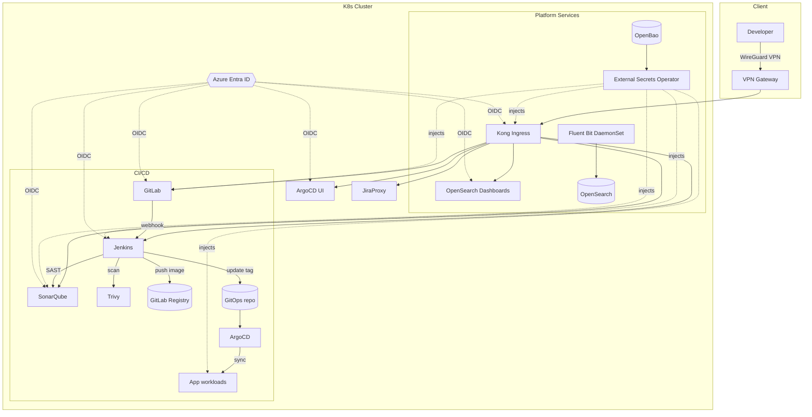

# DevSecOps CI/CD Platform — Implementation Design Spec

> **Audience:** coding agent / implementer. อ่านจบแล้วต้องลงมือสร้างได้โดยไม่ต้องเดา
> **Deliverable:** reference implementation ของ CI/CD platform ที่ deploy ด้วย GitOps ลง Kubernetes
> **Status:** authoritative spec — ถ้าโค้ดขัดกับเอกสารนี้ ให้ยึดเอกสารนี้เป็นหลัก

---

## 0. Objective & Definition of Done

สร้าง **self-hosted DevSecOps platform** ที่:
1. Developer push โค้ด → GitLab CE → Jenkins รัน CI (build, SAST, image scan) → push image → ArgoCD sync ลง cluster → expose ผ่าน Kong
2. ทุก UI tool ล็อกอินด้วย **Entra ID SSO (OIDC)** ตัวเดียว
3. ไม่มี secret hardcode — ทุก secret มาจาก **OpenBao** ผ่าน External Secrets Operator
4. ทุก service ส่ง log เข้า **OpenSearch**
5. Internal tools เข้าถึงได้เฉพาะผ่าน **VPN** เท่านั้น
6. เอกสาร/traceability พร้อมสำหรับ audit **ISO/IEC 29110**

**Done เมื่อ:** `terraform apply` + `argocd app sync` ครั้งเดียวแล้วได้ทั้ง platform ขึ้น, smoke test ใน §12 ผ่านทั้งหมด

---

## 1. Architecture Decisions (fixed — อย่าเปลี่ยนโดยไม่ถาม)

| # | Decision | Choice | เหตุผล |
|---|----------|--------|--------|
| AD-1 | Orchestration | **Kubernetes 1.30+** | ArgoCD/Kong/Helm ต้องการ k8s |
| AD-2 | Infra provisioning | **Terraform** | cluster, node pool, DNS, VPN, storage |
| AD-3 | App delivery | **ArgoCD app-of-apps + Helm** | GitOps, declarative |
| AD-4 | CI engine | **Jenkins (Kubernetes plugin, ephemeral agents)** | ต้องการ per-build pod |
| AD-5 | Secret delivery to k8s | **OpenBao + External Secrets Operator (ESO)** | k8s-native, ไม่ผูก sidecar |
| AD-6 | Ingress / API GW | **Kong Ingress Controller (DB-less, declarative)** | GitOps-friendly |
| AD-7 | SSO | **Entra ID OIDC** (SAML เฉพาะ tool ที่ไม่รองรับ OIDC) | ผู้ใช้เดียวทุก tool |
| AD-8 | Log pipeline | **Fluent Bit → OpenSearch** (Data Prepper ถ้าต้อง trace) | เบา, k8s DaemonSet |
| AD-9 | Image registry | **GitLab Container Registry** (built-in) | ลด component |
| AD-10 | Env model | `dev` / `staging` / `prod` เป็น namespace + ArgoCD project แยก | isolation |
| AD-11 | TLS | **cert-manager** + internal CA (หรือ Let's Encrypt สำหรับ public) | auto-rotate |
| AD-12 | Remote access | **WireGuard VPN gateway** หน้า internal services | zero public exposure ของ tool ภายใน |

---

## 2. Target Topology



**Trust boundaries:** เฉพาะ Kong (443) และ VPN endpoint (51820/udp) ที่รับ traffic จากภายนอก; ทุก tool UI ปิดจาก public, เข้าได้ผ่าน VPN → Kong เท่านั้น

---

## 3. Repository Layout (ให้ agent scaffold ตามนี้)

```
cicd-template/
├── docs/                          # spec นี้ + component specs
├── infra/                         # Terraform (AD-2)
│   ├── modules/{cluster,network,vpn,dns,storage}/
│   ├── envs/{dev,staging,prod}/main.tf
│   └── README.md
├── platform/                      # Helm values + ArgoCD (AD-3)
│   ├── argocd/
│   │   ├── bootstrap/             # root app-of-apps
│   │   └── apps/                  # 1 Application manifest ต่อ 1 tool
│   ├── charts/                    # values ต่อ tool (ใช้ upstream chart)
│   │   ├── gitlab/values-<env>.yaml
│   │   ├── jenkins/values-<env>.yaml
│   │   ├── sonarqube/values-<env>.yaml
│   │   ├── kong/values-<env>.yaml
│   │   ├── openbao/values-<env>.yaml
│   │   ├── opensearch/values-<env>.yaml
│   │   ├── external-secrets/values-<env>.yaml
│   │   ├── cert-manager/values-<env>.yaml
│   │   └── fluent-bit/values-<env>.yaml
│   └── secrets/                   # ExternalSecret + SecretStore manifests (ไม่มีค่า secret จริง)
├── ci/
│   ├── Jenkinsfile                # shared pipeline (§7)
│   ├── jenkins/casc.yaml          # Jenkins Configuration-as-Code
│   └── templates/                 # reusable pipeline library
├── gitops/                        # repo แยก (หรือ subtree) ที่ ArgoCD ดู app runtime tags
└── scripts/                       # bootstrap, smoke-test, seed
```

> ถ้าเป็น monorepo ให้ `gitops/` เป็นโฟลเดอร์; ถ้าแยก repo ให้ระบุ URL ใน `platform/argocd/apps/*`

---

## 4. Pinned Versions (baseline — bump ได้แต่ต้องอัปเดตตารางนี้)

| Component | Version | Chart / Source |
|-----------|---------|----------------|
| Kubernetes | 1.30 | infra |
| ArgoCD | 2.13.x | `argo/argo-cd` |
| GitLab CE | 17.x | `gitlab/gitlab` (CE values) |
| Jenkins | LTS 2.462.x | `jenkins/jenkins` |
| SonarQube | 10.x Community | `sonarqube/sonarqube` |
| Trivy | 0.55.x | CLI ใน pipeline + optional operator |
| Kong | 3.7.x (Ingress Controller 3.x) | `kong/kong` |
| OpenBao | 2.x | `openbao/openbao` |
| OpenSearch | 2.x | `opensearch/opensearch` (+ dashboards) |
| External Secrets Operator | 0.10.x | `external-secrets/external-secrets` |
| cert-manager | 1.15.x | `jetstack/cert-manager` |
| Fluent Bit | 3.x | `fluent/fluent-bit` |
| WireGuard | distro pkg | Terraform-provisioned VM |

---

## 5. Component Specs (สิ่งที่ต้องสร้างจริงต่อ tool)

รูปแบบ: **[Deploy] / [Config ที่ต้องมี] / [Integration] / [Acceptance]**

### 5.1 GitLab CE
- **Deploy:** Helm `gitlab/gitlab`, CE only, external PostgreSQL + object storage (S3-compatible) สำหรับ prod; built-in สำหรับ dev
- **Config:** เปิด Container Registry, webhook → Jenkins, protected branch `main`, project template สำหรับ repo ใหม่
- **Integration:** OIDC กับ Entra ID (§8); secret (DB, S3 key) จาก OpenBao ผ่าน ESO; log → Fluent Bit
- **Acceptance:** สร้าง project + push ได้ผ่าน VPN, ล็อกอินด้วย Entra, push image เข้า registry ได้

### 5.2 Jenkins
- **Deploy:** Helm `jenkins/jenkins`, controller + Kubernetes plugin (ephemeral pod agents), storage สำหรับ `$JENKINS_HOME`
- **Config:** **JCasC** (`ci/jenkins/casc.yaml`) — ไม่ตั้งค่าผ่าน UI; plugins: kubernetes, git, sonar-scanner, credentials-binding, oidc-auth; seed job ชี้ `ci/Jenkinsfile`
- **Integration:** OIDC login; credential (GitLab token, Sonar token, registry cred) มาจาก OpenBao; agent pod template มี trivy + sonar-scanner
- **Acceptance:** webhook จาก GitLab trigger build, agent pod spawn/teardown อัตโนมัติ, pipeline §7 รันครบ stage

### 5.3 SonarQube (Community)
- **Deploy:** Helm `sonarqube/sonarqube`, external PostgreSQL
- **Config:** Quality Gate = "Sonar way" (fail on new-code issues), project auto-provision, webhook กลับ Jenkins
- **Integration:** OIDC; DB secret จาก OpenBao; log → Fluent Bit
- **Acceptance:** `sonar-scanner` จาก Jenkins ส่งผลได้, quality gate fail ทำให้ pipeline fail

### 5.4 Trivy
- **Deploy:** CLI ใน Jenkins agent image (ไม่ต้อง server); optional `trivy-operator` สำหรับ scan cluster ต่อเนื่อง
- **Config:** scan targets = filesystem (deps), built image, IaC (`infra/`, Helm); severity gate: fail on `HIGH,CRITICAL`; cache DB layer
- **Integration:** ผลลัพธ์ (JSON/SARIF) เก็บเป็น artifact + ส่งสรุปเข้า OpenSearch
- **Acceptance:** image ที่มี CVE critical ทำให้ pipeline fail; รายงานแนบใน build

### 5.5 ArgoCD
- **Deploy:** Helm `argo/argo-cd`; **app-of-apps** root ที่ `platform/argocd/bootstrap`
- **Config:** AppProject ต่อ env (dev/staging/prod); sync policy: dev=auto, prod=manual+approval; sourceไป `gitops/`
- **Integration:** OIDC (Entra) + RBAC group→role; repo cred จาก OpenBao
- **Acceptance:** merge ที่ `gitops/` เปลี่ยน image tag → ArgoCD sync ออก workload ใหม่; UI แสดง health/sync ถูกต้อง

### 5.6 Kong (Ingress Controller, DB-less)
- **Deploy:** Helm `kong/kong`, mode DB-less declarative
- **Config:** Ingress + KongPlugin CRDs; plugins: `oidc`(หรือ `openid-connect`), `rate-limiting`, `prometheus`, `request-id`; routes ต่อ tool UI
- **Integration:** cert-manager ออก TLS; OIDC plugin ชี้ Entra; log → Fluent Bit
- **Acceptance:** ทุก tool เข้าผ่าน `https://<tool>.<domain>` ผ่าน Kong เท่านั้น, unauthenticated ถูก redirect ไป Entra

### 5.7 Azure Entra ID (SSO) — ดู §8

### 5.8 OpenBao
- **Deploy:** Helm `openbao/openbao`, HA (Raft, 3 replicas) สำหรับ prod, auto-unseal (cloud KMS) ถ้ามี
- **Config:** auth methods: `kubernetes` (ให้ ESO/pod), `oidc` (ให้คน); KV v2 mount `secret/`; policy least-privilege ต่อ tool
- **Integration:** เป็น source of truth ของ secret ทั้งหมด; ESO ดึงผ่าน SecretStore (k8s auth)
- **Acceptance:** ESO sync secret เข้า namespace ได้, ไม่มี plaintext secret ใน git, unseal สำเร็จหลัง restart

### 5.9 OpenSearch (+ Dashboards)
- **Deploy:** Helm `opensearch/opensearch` (3 master/data สำหรับ prod) + `opensearch-dashboards`
- **Config:** index template + ISM policy (hot→delete ตาม retention เช่น 30/90 วัน); role mapping จาก Entra group
- **Integration:** รับ log จาก Fluent Bit; Dashboards OIDC login ผ่าน Kong
- **Acceptance:** log จากทุก tool ค้นได้ใน Dashboards, ISM rollover ทำงาน

### 5.10 Jira
- **Deploy:** external SaaS/self-hosted (ไม่ deploy ใน cluster) — spec นี้กำหนดเฉพาะ **integration**
- **Config:** project + workflow ที่ map ISO 29110 (Requirement→Design→Build→Test→Done); smart commit เปิด
- **Integration:** GitLab MR ↔ Jira issue key (`PROJ-123`); Jenkins comment build result; traceability field
- **Acceptance:** commit ที่อ้าง issue key อัปเดต Jira; MR link ปรากฏใน issue

### 5.11 VPN Gateway (WireGuard)
- **Deploy:** Terraform VM (`infra/modules/vpn`), WireGuard, peer config ต่อ user
- **Config:** อนุญาตเฉพาะ subnet ของ cluster ingress; ไม่มี tool UI ใด public; MFA ที่ชั้น Entra
- **Integration:** route ไป Kong internal LB
- **Acceptance:** ปิด VPN → เข้า tool ไม่ได้; เปิด VPN → เข้าได้

### 5.12 Cloud / Server Hosting
- **Deploy:** Terraform (`infra/`) — cluster, node pools (system/ci/data taints), storage class, DNS, backup
- **Config:** node pool แยก: `ci` (spot ได้, autoscale) vs `data` (stable, PV); network policy default-deny
- **Acceptance:** `terraform apply` ต่อ env สร้าง infra ครบ, kubeconfig ใช้งานได้

---

## 6. Cross-cutting Integration Rules

- **Secrets:** ห้าม `Secret` ที่มีค่าจริงใน git. ใช้ `ExternalSecret` ชี้ OpenBao เท่านั้น. Bootstrap secret (OpenBao root/unseal) เก็บนอก git (KMS/manual)
- **SSO:** ทุก UI ต้องผ่าน OIDC; local admin เปิดเฉพาะ break-glass และปิดหลัง bootstrap
- **Logging:** ทุก workload label `app.kubernetes.io/*` ให้ Fluent Bit เติม metadata; ห้าม log secret
- **TLS:** ทุก route ผ่าน cert-manager; internal ใช้ CA เดียว
- **Naming:** namespace = tool name; DNS = `<tool>.<env>.<domain>`

---

## 7. CI Pipeline (Jenkinsfile — concrete stages)

```groovy
// ci/Jenkinsfile — declarative, agent = ephemeral k8s pod (trivy + sonar-scanner baked in)
pipeline {
  agent { kubernetes { yamlFile 'ci/templates/agent-pod.yaml' } }
  stages {
    stage('Checkout')   { steps { checkout scm } }
    stage('Build')      { steps { sh 'make build' } }                 // build artifact/image
    stage('Unit Test')  { steps { sh 'make test' }
                          post { always { junit '**/test-results/*.xml' } } }
    stage('SAST')       { steps { withSonarQubeEnv('sonar') { sh 'sonar-scanner' } } }
    stage('Quality Gate'){ steps { timeout(time:10,unit:'MINUTES'){ waitForQualityGate abortPipeline:true } } }
    stage('Scan Deps')  { steps { sh 'trivy fs --severity HIGH,CRITICAL --exit-code 1 .' } }
    stage('Package')    { steps { sh 'docker build -t $REGISTRY/$APP:$GIT_COMMIT .' } }
    stage('Scan Image') { steps { sh 'trivy image --severity HIGH,CRITICAL --exit-code 1 $REGISTRY/$APP:$GIT_COMMIT' } }
    stage('Push')       { steps { sh 'docker push $REGISTRY/$APP:$GIT_COMMIT' } }
    stage('Promote (GitOps)') {
      steps { sh './scripts/bump-image.sh gitops/apps/$APP $GIT_COMMIT' } // commit → ArgoCD sync
    }
  }
  post {
    always  { sh './scripts/report-to-opensearch.sh' }   // ship build metadata
    success { jiraComment(issueKey: env.JIRA_KEY, body: "Build ${env.GIT_COMMIT} passed") }
  }
}
```

**Gate rules:** SAST quality gate fail, Trivy HIGH/CRITICAL, unit test fail → pipeline fail และไม่ push image

---

## 8. Entra ID OIDC — ต่อ tool ที่ต้องตั้ง

สร้าง **App Registration** 1 ตัวต่อ 1 tool (หรือ 1 shared + redirect หลายตัว) ระบุ:

| Tool | Protocol | Redirect URI | Group→Role mapping |
|------|----------|--------------|--------------------|
| GitLab | OIDC | `/users/auth/openid_connect/callback` | `gitlab-admins`→Admin |
| Jenkins | OIDC | `/securityRealm/finishLogin` | `jenkins-admins`→Administer |
| SonarQube | OIDC/SAML | `/oauth2/callback/oidc` | `sonar-admins`→Admin |
| ArgoCD | OIDC | `/auth/callback` | `argocd-admins`→role:admin |
| OpenSearch Dash | OIDC | `/auth/openid/login` | group→backend role |
| Kong (edge) | OIDC plugin | per-route | enforce ก่อนถึง upstream |

**ต้องเก็บใน OpenBao:** `client_id`, `client_secret`, `issuer/discovery URL`, `tenant_id` → ESO sync เข้าแต่ละ namespace

---

## 9. Environments

| Env | Sync | HA | ใครเข้าถึง | หมายเหตุ |
|-----|------|----|-----------|---------|
| dev | ArgoCD auto | single replica | dev ทีม via VPN | built-in DB ได้ |
| staging | ArgoCD auto | 2 replica | QA/reviewer | mirror prod config |
| prod | ArgoCD **manual+approval** | full HA | ops เท่านั้น | external DB/storage, auto-unseal |

---

## 10. ISO 29110 Traceability Hook

โยง artifact ในโปรเจกต์ ↔ deliverable มาตรฐาน (รายละเอียดใน `docs/iso29110-mapping.md`):

| ISO 29110 (SI process) | Artifact ในระบบนี้ |
|------------------------|--------------------|
| Requirements Specification | Jira epic/story + `docs/*` |
| Software Architecture & Design | **spec นี้** + component specs |
| Construction (Software Component) | GitLab repo + MR |
| Software Test | Jenkins test stage + SonarQube report |
| Traceability Record | Jira ↔ commit ↔ build ↔ ArgoCD sync |
| Version Control / Config Mgmt | GitLab + GitOps repo |

---

## 11. Build Order สำหรับ coding agent (ทำตามลำดับ)

1. **infra/** — Terraform: network, cluster, storage, DNS, VPN → ได้ kubeconfig
2. **cert-manager + ESO + OpenBao** — ฐาน secret/TLS ก่อน (OpenBao ก่อน ESO)
3. **ArgoCD** — ติดตั้ง + bootstrap app-of-apps (ต่อจากนี้ทุกอย่างผ่าน GitOps)
4. **Kong** — ingress + TLS + OIDC edge
5. **GitLab CE** — SCM + registry
6. **Jenkins** (JCasC) + agent pod image (trivy + sonar-scanner)
7. **SonarQube**
8. **OpenSearch + Dashboards + Fluent Bit**
9. **Entra ID OIDC** wiring ต่อ tool (§8)
10. **gitops/** sample app + `ci/Jenkinsfile` เดิน end-to-end
11. **scripts/smoke-test.sh** ตาม §12

> ทุกขั้น: values อยู่ใน `platform/charts/*/values-<env>.yaml`, deploy ผ่าน ArgoCD Application ไม่ใช่ `helm install` ตรง (ยกเว้น bootstrap ข้อ 2–3)

---

## 12. Smoke Test / Acceptance (ต้องผ่านทั้งหมด)

- [ ] `terraform apply` (dev) สำเร็จ, kubeconfig ใช้ได้
- [ ] ปิด VPN → เข้า tool UI ใดๆ ไม่ได้; เปิด VPN → เข้าได้
- [ ] ล็อกอินทุก UI ด้วย Entra บัญชีเดียว
- [ ] ไม่มี plaintext secret ใน git (`grep`/`trivy config` ผ่าน)
- [ ] push โค้ดใหม่ → Jenkins build อัตโนมัติจาก webhook
- [ ] pipeline fail จริงเมื่อ SonarQube gate fail หรือ Trivy เจอ CRITICAL
- [ ] image ที่ผ่าน push เข้า GitLab registry
- [ ] merge GitOps → ArgoCD sync workload ใหม่ (dev auto, prod manual)
- [ ] log จากทุก tool ค้นเจอใน OpenSearch Dashboards
- [ ] commit อ้าง `PROJ-123` อัปเดต Jira issue

---

## 13. Open Decisions (ต้องยืนยันก่อน prod)

- [ ] Cloud provider ที่แน่นอน (Azure ตรงกับ Entra? / on-prem?) → กระทบ `infra/modules`
- [ ] Domain + internal CA vs public Let's Encrypt
- [ ] OpenBao auto-unseal: cloud KMS ตัวไหน หรือ manual/Shamir
- [ ] Jira: Cloud หรือ Data Center → กระทบวิธี integrate
- [ ] Backup target (object storage) และ RPO/RTO ที่ยอมรับได้
